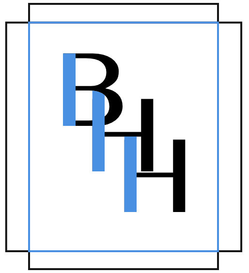

<p align="center">
  <a href="https://bea-hh.com">
    
  </a>
</p>
<h1 align="center">
  Beatriz Herce-Hagiwara x Thrive
  <div style="font-size: medium; padding-top: 10px">Gatsby Site</div>
</h1>

## 🚀 Quick start

1.  **Clone Repository**

    In the directory of your choosing, enter the following into the command line: 

    ```shell
    # git clone the repository for this project
    git clone https://github.com/bea-hh/thrive-gatsby-site.git
    ```

2.  **Install Packages**

    Navigate into the site's directory: "thrive-gatsby-site" and install node packages.

    ```shell
    cd thrive-gatsby-site/
    npm install
    ```

3. **Start it up!**

    In the same directory, run the following command:

    ```shell
    gatsby develop
    ```

4.  **Check it out!**

    This site is now running at http://localhost:8000!

    Visit `src/pages/index.js` to review relevant code.
